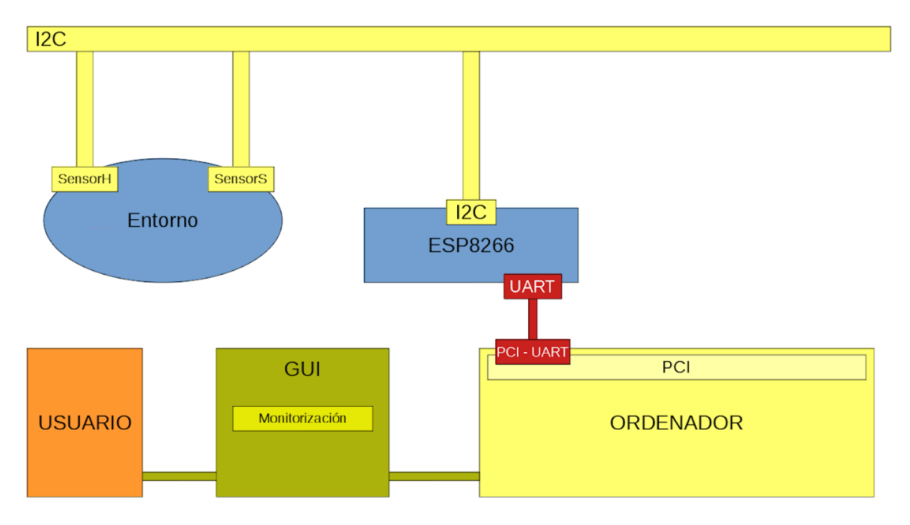

Electronic prototype to **monitor several environmental magnitudes** through the usage of self-implemented sensors.

## TABLE OF CONTENTS
1.  [Motivation](#motivation)
2.  [Technologies and Frameworks](#technologies-and-frameworks)
3.  [System Design](#system-design)
4.  [Features](#features)
5.  [Documentation](#documentation)
6.  [Credits](#credits)
7.  [Acknowledgements](#acknowledgements)

## MOTIVATION
This is a team effort for our first semester class CDIO. This project follows an **agile software development approach** (SCRUM).

## TECHNOLOGIES AND FRAMEWORKS
### Electronic devices and components
*   Sparkfun **ESP8266 Thing Dev** Board.
*   Adafruit **ADS1115** 16-bit ADC.
*   Humidity sensor.
*   Protoboard.
*   Resistors.
*   Thermistor.
*   Accelerometer.

### Software Development 
*   Arduino IDE (to interact with the ESP8266 board). 
*   Third-party text editors.

## SYSTEM DESIGN
### Sofware Architecture

### Hardware Architecture

## FEATURES
### Implemented 
*   Humidity sensor.
*   Salinity sensor (basic implementation via electrical conductivity).

### Work in progress
*   Temperature sensor (testing).
*   Hibernation (deep sleep mode).
*   Accelerometer (anti-griefing).

### Coming soon
*   Automated Testing.
*   Semiautomatic calibration (based on user interaction).

## DOCUMENTATION
It can be found in the form of a PDF file, for each and every Sprint, accordingly. Refer to the latest Sprint directory for an [up-to-date documentation](Sprint1/Sprint1_Documentación.pdf).

## CREDITS
| Author                    |
|---------------------------| 
| Abidán Brito Clavijo      |
| Pablo Enguix Llopis       |
| Luis Belloch Martínez     |
| Elvira Montagud Hernandis |

## ACKNOWLEDGEMENTS
I would like to express my sincere gratitude to my teacher **Mª Asunción Pérez Pascual** for her invaluable support, feedback and encouragement throughout the development of this project, and to **Universitat Politècnica de València** for providing us with both the knowledge and the tools needed to complete it.
